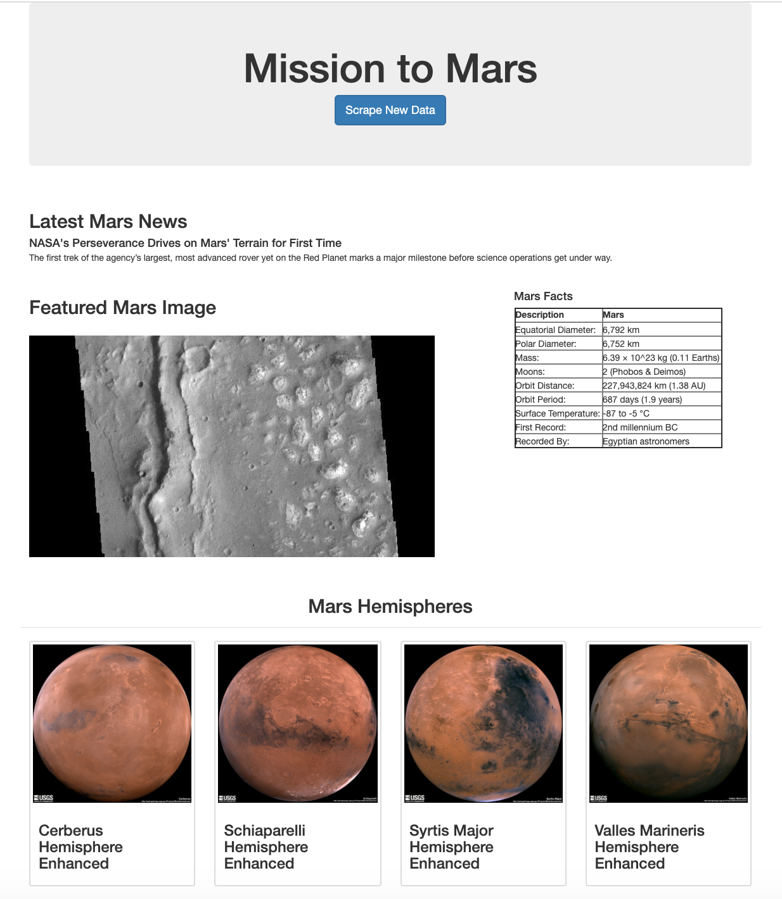

# Web Scraping: Mission to Mars


## Task

To build a web application that scrapes various websites for data related to the Mission to Mars and displays the information in a single HTML page. 

## Tools and Technologies

- Jupyter Notebook
- Pandas
- Python
- BeautifulSoup
- Requests
- Splinter
- MongoDB
- Flask
- HTML


## 1: Scraping

### NASA Mars News

* Scraped the [NASA Mars News Site](https://mars.nasa.gov/news/), collecting the latest News Title and Paragraph Text. Assigned the text to variables for later reference.

```python
# Example:
news_title = "NASA's Next Mars Mission to Investigate Interior of Red Planet"

news_p = "Preparation of NASA's next spacecraft to Mars, InSight, has ramped up this summer, on course for launch next May from Vandenberg Air Force Base in central California -- the first interplanetary launch in history from America's West Coast."
```

### JPL Mars Space Images - Featured Image

* Visited the url for JPL Featured Space Image [here](https://data-class-jpl-space.s3.amazonaws.com/JPL_Space/index.html).

* Used splinter to navigate the site and find the image url for the current Featured Mars Image and assigned the url string to a variable called `featured_image_url`.

* Ensuerd the image url was to the full size `.jpg` image.

* Save a complete url string for this image.

```python
# Example:
featured_image_url = 'https://data-class-jpl-space.s3.amazonaws.com/JPL_Space/images/largesize/PIA16225_hires.jpg'
```

### Mars Facts

* Visited the Mars Facts webpage [here](https://space-facts.com/mars/) and used Pandas to scrape the table containing facts about the planet including Diameter, Mass, etc.

* Used Pandas to convert the data to a HTML table string.


### Mars Hemispheres

* Visited the USGS Astrogeology site [here](https://astrogeology.usgs.gov/search/results?q=hemisphere+enhanced&k1=target&v1=Mars) to obtain high resolution images for each of Mar's hemispheres.

* Navigated the page with splinter to select each of the links to the hemispheres in order to find the image url of the full resolution image.

* Saved both the image url string for the full resolution hemisphere image, and the Hemisphere title containing the hemisphere name. Used a Python dictionary to store the data using the keys `img_url` and `title`.

* Appended the dictionary with the image url string and the hemisphere title to a list. This list contained one dictionary for each hemisphere.

```python
# Example:
hemisphere_image_urls = [
    {"title": "Valles Marineris Hemisphere", "img_url": "..."},
    {"title": "Cerberus Hemisphere", "img_url": "..."},
    {"title": "Schiaparelli Hemisphere", "img_url": "..."},
    {"title": "Syrtis Major Hemisphere", "img_url": "..."},
]
```

- - -


## 2: MongoDB and Flask Application

Used MongoDB with Flask templating to create a HTML page that displays all of the information that was scraped from the URLs above.

* Started by converting the Jupyter notebook into a Python script called `scrape_mars.py` with a function called `scrape` that executes all of the scraping code from above and returns one Python dictionary containing all of the scraped data.

* Next, created a route called `/scrape` that imports the `scrape_mars.py` script and calls the `scrape` function.

  * Stored the return value in Mongo as a Python dictionary.

* Created a root route `/` that queries the Mongo database and parses the mars data into a HTML template to display the data.

* Created a template HTML file called `index.html` that takes the mars data dictionary and displays all of the data in the appropriate HTML elements. 


## Viewing

To view the flask app on a local machine, navigate to the directory which contains the file and run `python app.py` in terminal.

Clicking the 'Scrape New Data' button will scrape and display the most recent data.


## Preview


